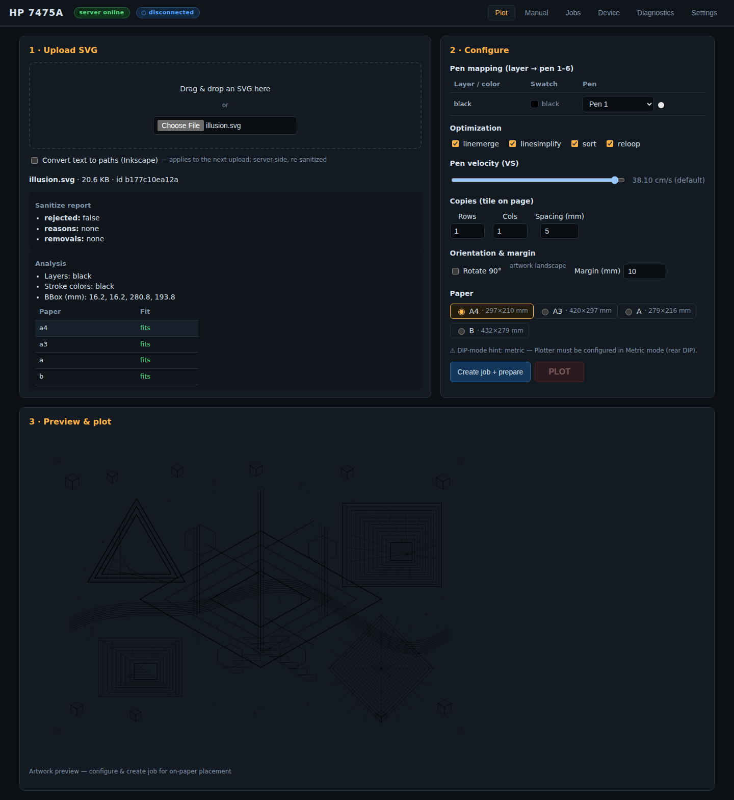
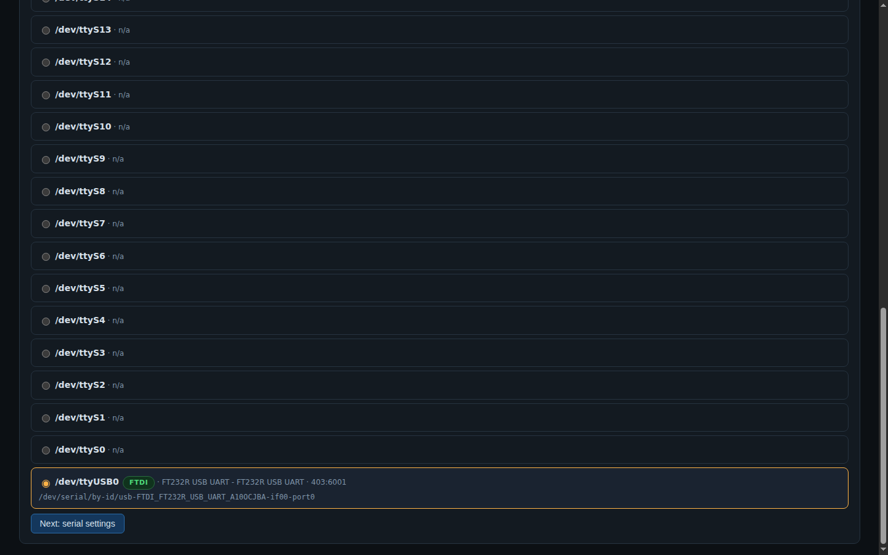
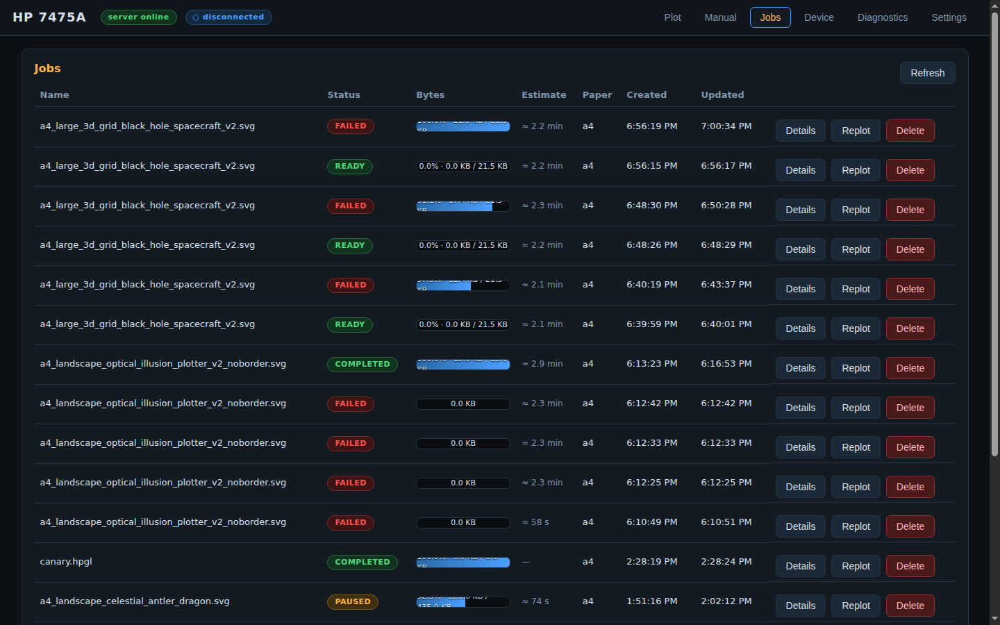
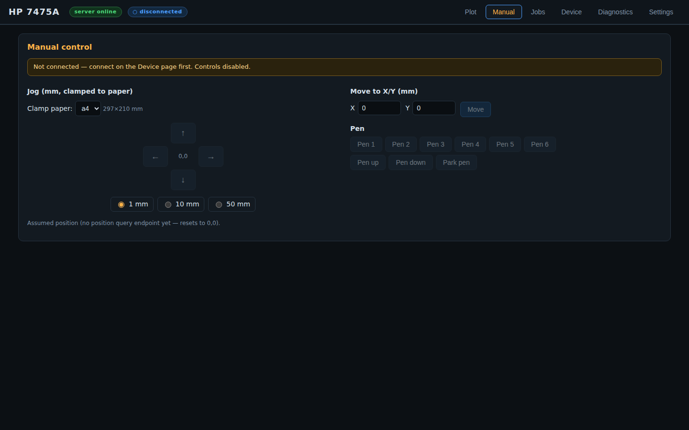
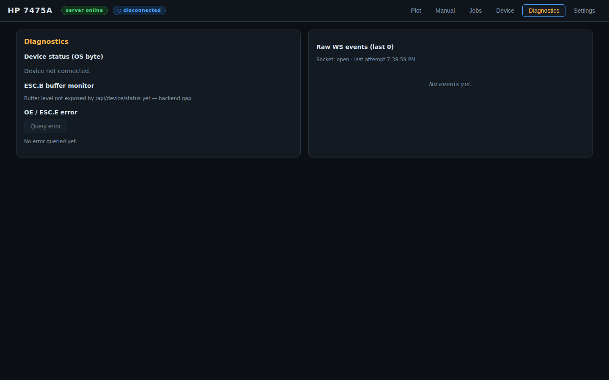

# HP 7475A Web Plotter Controller

Browser-based control surface for the HP 7475A six-pen pen plotter:
upload SVG → map layers to pens → preview exactly what will be plotted →
plot with buffer-safe HP-GL streaming over RS-232-C.

FastAPI backend · React/TypeScript frontend · SQLite job history ·
PTY fake plotter for automated tests · verified against the HP manuals.

> Protocol facts (buffer handshake, output instructions, hard-clip limits,
> status byte, error codes) were extracted from the official manuals and are
> documented with citations in [`docs/hardware-notes.md`](docs/hardware-notes.md).
> Constants live in one place:
> [`backend/app/services/serial/protocol.py`](backend/app/services/serial/protocol.py).

## Screenshots

**Plot — upload, sanitize report, analysis & configuration**
(pen mapping, optimization, pen-velocity `VS`, tiling, rotation/margin, paper size,
paper-fit table; live shot with a real artwork):



**Device — connection wizard** (port discovery; flags FTDI adapters and shows the
stable `/dev/serial/by-id` path; serial settings → identity check → paper check):



**Jobs — history with live progress** (bytes-sent progress bars, time estimates,
per-job details / replot / delete):



**Manual — jog pad & pen control** (mm steps clamped to paper, move-to X/Y, pen
select / up / down / park):



**Diagnostics — status byte, buffer monitor, error registers, raw WS events:**



## Features

- **Connection wizard** — port discovery (prefers stable `/dev/serial/by-id`
  paths, flags FTDI adapters + permission problems), serial settings, and an
  identity check (`OI` → `7475A`) before anything moves.
- **SVG pipeline** — fail-closed sanitizer (scripts, event handlers, XXE,
  `foreignObject`, external refs removed/rejected), analyzer (layers, stroke
  colors, unsupported-content report), vpype-powered optimization
  (linemerge / linesimplify / sort / reloop), pen mapping, and a
  **post-processing preview** — you see what the plotter will draw.
- **HP-GL safety validator** — allowlist of the verified 7475A instruction
  subset; rejects output instructions and escape sequences in job payloads,
  clamps/warns on out-of-hard-clip coordinates, pen range checks.
- **Buffer-safe streaming** — software-checking handshake per the manual:
  query `ESC .B` free space → send at most `free − 32` bytes ending on an
  instruction boundary → repeat. Configurable alternates: XON/XOFF,
  hardware DTR, diagnostic chunk/delay.
- **Real completion detection** — an `OA` query queued after the final park
  command answers only when previously buffered motion has executed
  (output instructions reply in parse order). "All bytes sent" ≠ "plot
  finished"; the job stays `COMPLETING` until the plotter actually replies.
- **Single-writer job queue** — one hardware worker owns the serial port;
  states QUEUED→PREPARING→READY→SENDING→PLOTTING→COMPLETING→COMPLETED with
  PAUSED/CANCELLED/FAILED/DISCONNECTED, pause/resume/cancel, history.
- **Vectorize tab** — raster single-line drawings (PNG/JPG) → SVG via
  [SLD-Vectorization](https://github.com/tanguymagne/SLD-Vectorization)
  (server-side CLI, auto or manual threshold, multi-stroke mode), with
  preview, SVG download and one-click **Send to Plot** into the normal
  upload → pen-map → plot pipeline.
- **Manual controls** — jog pad (mm or plotter units, hard-clip clamped),
  pen up/down/select, park, velocity — disabled when disconnected.
- **Live status** — WebSocket updates (job progress, device events), status
  byte bits (pen down / ready / error), `OE`/`ESC .E` error decoders.

## Quick start (development)

```bash
# backend + frontend together
./scripts/dev.sh
# → API on http://127.0.0.1:8750  ·  UI on http://127.0.0.1:5173
```

or manually:

```bash
python3 -m venv .venv && .venv/bin/pip install -e backend
.venv/bin/uvicorn app.main:app --app-dir backend --reload   # API :8750
cd frontend && npm install && npm run dev                    # UI :5173
```

## Production

```bash
./scripts/build.sh   # tests + frontend bundle staged into backend
.venv/bin/uvicorn app.main:app --app-dir backend --host 127.0.0.1 --port 8750
```

Systemd unit (edit paths/user first): [`deploy/systemd/hp7475a-web.service`](deploy/systemd/hp7475a-web.service)

```bash
sudo cp deploy/systemd/hp7475a-web.service /etc/systemd/system/
sudo systemctl enable --now hp7475a-web
```

### Serial port permissions (Linux)

Your service/desktop user needs write access to the USB serial adapter:

```bash
sudo usermod -aG dialout $USER   # then log out/in
```

The connection wizard shows a hint automatically when access is denied.

### Network exposure

The server binds `127.0.0.1` by default. There is **no authentication**;
if you set `HP7475A_HOST=0.0.0.0`, anyone on the LAN can command your
plotter — only on trusted, isolated networks.

## Hardware setup

1. HP 7475A ← DB25 serial cable ← FTDI USB adapter ← host.
2. Plotter rear DIP switches must match the app settings (default 9600 8N1)
   **and** the paper mode (metric A4/A3 vs imperial A/B).
3. Power on, load paper + pens, then use the in-app wizard:
   detect → connect (identity verified) → check paper via `OH`.

See [`docs/serial-troubleshooting.md`](docs/serial-troubleshooting.md) if the
plotter stays silent, and [`docs/hardware-acceptance-test.md`](docs/hardware-acceptance-test.md)
for the physical validation procedure.

## Testing

```bash
.venv/bin/pytest backend/tests -q     # unit + security + fake-PTY E2E
cd frontend && npm test               # component tests
```

All automated tests run against the PTY fake plotter
([`backend/app/services/serial/fakeplotter.py`](backend/app/services/serial/fakeplotter.py))
— no hardware needed. Physical-device items are listed as
**READY FOR USER HARDWARE TEST** in [`TASKS.md`](TASKS.md).

## Repository layout

```
backend/app
  api/          REST + WebSocket routes
  jobs/         state machine, store, streamer, hardware worker
  services/
    serial/     protocol · paper · discovery · transport · driver · fake plotter
    pipeline/   sanitizer · analyzer · vpype integration · HP-GL writer/validator
  main.py       app factory
frontend/       React + TS (Vite)
docs/           hardware notes · spec · architecture · runbooks
deploy/         systemd unit
```

## License

MIT (see [LICENSE](LICENSE)).
